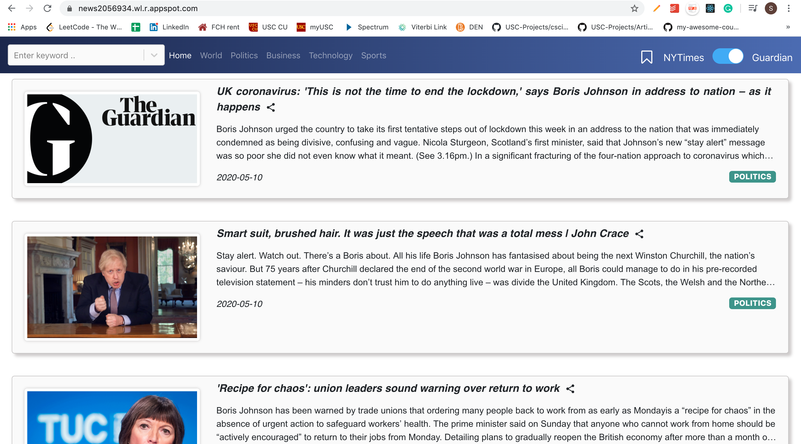
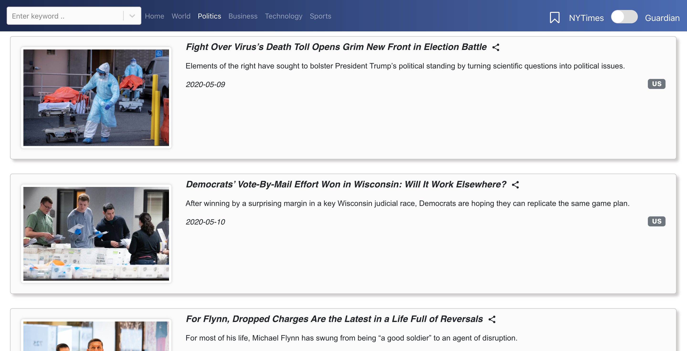
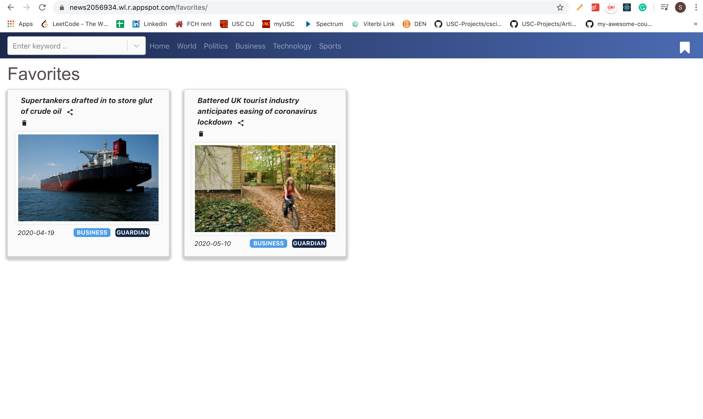
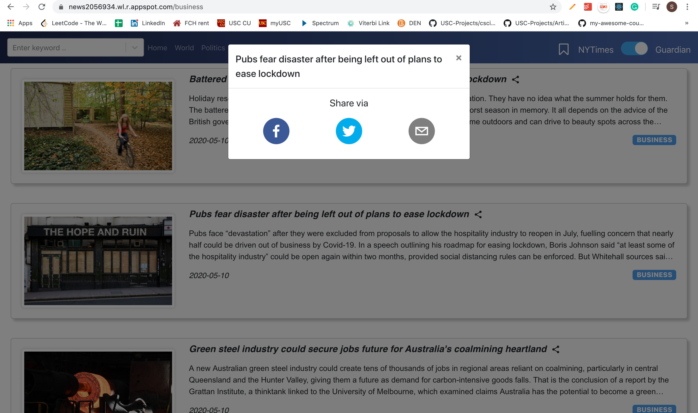

# React-News-App
A React + Node powered news app using Guardian &amp; NYTimes News API to render trending news

It was deployed on https://news2056934.wl.r.appspot.com/

This project was bootstrapped with [Create React App](https://github.com/facebook/create-react-app).

## Synopsis

This project was completed as a part of my coursework for the course CSCI 571: Web Technologies at the University of Southern California, Spring 2020 under Prof. Marco Papa.

## Available Scripts

In the project directory, you can run:

### `npm start`

Runs the app in the development mode. 
Open [http://localhost:3000](http://localhost:3000) to view it in the browser.

The page will reload if you make edits. 
You will also see any lint errors in the console.

### `npm run build`

Builds the app for production to the `build` folder. 
It correctly bundles React in production mode and optimizes the build for the best performance.

The build is minified and the filenames include the hashes. 
Your app is ready to be deployed!

## Screenshots

<h2>Guardian News</h2>

<h2>NYTimes News</h2>

<h2>Detailed Version of news</h2>

<h2>Comment Box </h2>

<h2>Bookmarking functionality</h2>

<h2>Sharing news via social media platforms such as Twitter, Facebook and Email</h2>

  
  
  
### Tech Stack of this Project:

* Backend: Node JS
* Front-end: React JS
* Dependencies: Guardian News API , NYTimes News API, CommentBox.io API, Twitter API, Facebook API

<h3 align="center"><b>Developed by <a href="https://github.com/Shraddha2104">Shraddha Shaligram</a>.</b></h1>

